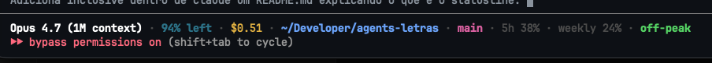

# statusline

Statusline custom pro Claude Code. Substitui a barra padrão por uma versão compacta e colorida, com:

- modelo em uso
- contexto restante (verde > 50%, amarelo 20-50%, vermelho < 20%)
- custo acumulado da sessão
- diretório atual com `~` resolvido
- branch git
- uso do rate limit de 5h e semanal
- indicador `peak` / `off-peak` baseado em America/Sao_Paulo (9h-15h é peak)



## Instalação

Em `~/.claude/settings.json`:

```json
{
  "statusLine": {
    "type": "command",
    "command": "python3 /caminho/para/statusline-command.py"
  }
}
```

Requer Python 3.9+ (usa `zoneinfo`).

## Cores

Honra `NO_COLOR` e `CLAUDE_STATUSLINE_NO_COLOR=1` pra ambientes sem ANSI.
